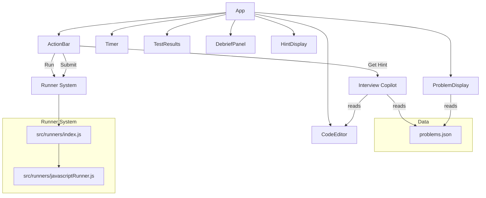
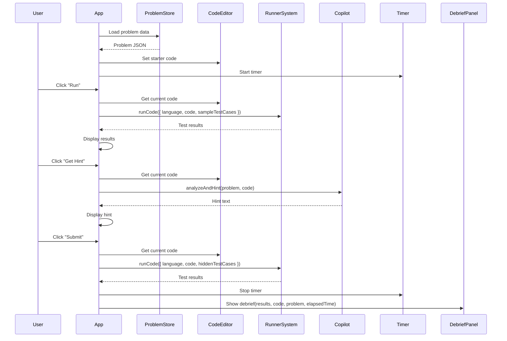

# Design Document

## Overview

AlgoMentor is a single-page React application that simulates a mock technical interview. The user is presented with a coding problem (starting with "Two Sum"), writes a solution in a Monaco-based code editor, runs it against sample and hidden test cases, receives hints from an Interview Copilot, and gets a comprehensive debrief after submission.

The application runs entirely in the browser. Code execution uses the `Function` constructor to evaluate user-submitted JavaScript in a lightweight sandbox. Problem data is loaded from a local JSON file bundled with the app. The debrief panel computes feedback (complexity analysis, edge cases, alternative approaches, readiness score) using heuristic analysis of the user's code and test results.

### Key Design Decisions

1. **`Function` constructor for code execution** — For an MVP, this provides simple in-browser execution without needing a backend or Web Workers. A timeout mechanism wraps execution to enforce the 5-second limit. This is acceptable for a local learning tool; a production system would use a sandboxed iframe or Web Worker.
2. **`@monaco-editor/react`** — The most popular Monaco wrapper for React, works out of the box with Vite (no webpack config needed).
3. **Static problem data** — Problems are stored in a JSON file imported at build time. No API calls needed for the MVP.
4. **Heuristic debrief analysis** — Complexity analysis, edge case detection, and alternative approaches are generated using pattern-matching heuristics on the user's code and the problem metadata. No LLM integration for the MVP.

## Architecture



### Application Flow



### Project Structure

```
src/
├── App.jsx                    # Root component, state management
├── main.jsx                   # Vite entry point
├── index.css                  # Tailwind imports
├── components/
│   ├── ProblemDisplay.jsx     # Problem title, description, examples
│   ├── CodeEditor.jsx         # Monaco Editor wrapper
│   ├── ActionBar.jsx          # Run, Submit, Get Hint buttons
│   ├── Timer.jsx              # Elapsed time display
│   ├── TestResults.jsx        # Test case result list
│   ├── HintDisplay.jsx        # Hint text display
│   └── DebriefPanel.jsx       # Post-submission debrief
├── runners/
│   ├── index.js               # Runner dispatcher: runCode()
│   └── javascriptRunner.js    # JS execution via Function constructor
├── services/
│   ├── copilot.js             # Hint generation logic
│   └── debrief.js             # Debrief analysis logic
├── data/
│   └── problems.json          # Problem definitions
└── utils/
    └── timer.js               # Timer utility functions
```

## Components and Interfaces

### App (Root Component)

The root component owns the application state and orchestrates interactions between child components.

**State:**
- `problem` — The currently loaded problem object
- `code` — The current editor content (string)
- `testResults` — Array of test case results from the last run/submit
- `hints` — Array of hint strings shown to the user
- `elapsedTime` — Elapsed seconds from the timer
- `timerRunning` — Boolean indicating if the timer is active
- `view` — Current view mode: `"coding"` | `"debrief"`
- `debriefData` — The computed debrief object after submission
- `loadError` — Error message if problem loading fails

**Callbacks passed to children:**
- `onRun()` — Triggers sample test execution
- `onSubmit()` — Triggers hidden test execution + debrief
- `onGetHint()` — Triggers hint generation
- `onCodeChange(newCode)` — Updates code state from editor

### ProblemDisplay

Renders the problem details in a scrollable panel.

```ts
interface ProblemDisplayProps {
  problem: Problem | null;
  loadError: string | null;
}
```

### CodeEditor

Wraps `@monaco-editor/react` with JavaScript configuration.

```ts
interface CodeEditorProps {
  code: string;
  onChange: (value: string) => void;
}
```

### ActionBar

Renders the Run, Submit, and Get Hint buttons.

```ts
interface ActionBarProps {
  onRun: () => void;
  onSubmit: () => void;
  onGetHint: () => void;
  isRunning: boolean;
}
```

### Timer

Displays elapsed time in `MM:SS` format. Uses `setInterval` internally.

```ts
interface TimerProps {
  running: boolean;
  elapsedTime: number;
  onTick: (seconds: number) => void;
}
```

### TestResults

Displays a list of test case results with pass/fail status.

```ts
interface TestResultsProps {
  results: TestCaseResult[];
}
```

### HintDisplay

Shows accumulated hints from the Interview Copilot.

```ts
interface HintDisplayProps {
  hints: string[];
}
```

### DebriefPanel

Displays the full debrief after submission.

```ts
interface DebriefPanelProps {
  debrief: DebriefData;
  onBack: () => void;
}
```

### Runner System — `src/runners/index.js`

```js
/**
 * @param {{ language: string, code: string, testCases: TestCase[] }} params
 * @returns {Promise<TestCaseResult[]>}
 */
export async function runCode({ language, code, testCases })
```

Dispatches to language-specific runners. Returns an array of results. Throws if the language is unsupported.

### JavaScript Runner — `src/runners/javascriptRunner.js`

```js
/**
 * @param {{ code: string, testCases: TestCase[], timeoutMs?: number }} params
 * @returns {Promise<TestCaseResult[]>}
 */
export async function runJavaScript({ code, testCases, timeoutMs = 5000 })
```

Executes user code using the `Function` constructor. Wraps each test case execution in a `Promise.race` with a timeout to enforce the 5-second limit. Catches runtime errors and returns them as error results.

### Copilot Service — `src/services/copilot.js`

```js
/**
 * @param {{ problem: Problem, code: string, previousHints: string[] }} params
 * @returns {string} hint text
 */
export function generateHint({ problem, code, previousHints })
```

Analyzes the problem and user code to produce a progressive hint. Uses heuristic checks (e.g., does the code use a hash map? does it handle edge cases?) to determine what guidance to offer. Avoids returning complete solution code.

### Debrief Service — `src/services/debrief.js`

```js
/**
 * @param {{ problem: Problem, code: string, results: TestCaseResult[], elapsedTime: number }} params
 * @returns {DebriefData}
 */
export function generateDebrief({ problem, code, results, elapsedTime })
```

Computes the full debrief: correctness summary, complexity analysis, code feedback, missed edge cases, alternative approaches, and readiness score.

## Data Models

### Problem

```ts
interface Problem {
  id: string;
  title: string;
  difficulty: "Easy" | "Medium" | "Hard";
  description: string;
  examples: Example[];
  constraints: string[];
  starterCode: string;
  sampleTestCases: TestCase[];
  hiddenTestCases: TestCase[];
  hints: HintConfig;
  debrief: DebriefConfig;
}
```

### Example

```ts
interface Example {
  input: string;
  output: string;
  explanation?: string;
}
```

### TestCase

```ts
interface TestCase {
  id: string;
  input: any[];       // Arguments to pass to the user's function
  expected: any;       // Expected return value
  description?: string;
}
```

### TestCaseResult

```ts
interface TestCaseResult {
  testCaseId: string;
  passed: boolean;
  expected: any;
  actual: any;
  error?: string;      // Runtime error message, if any
  timedOut?: boolean;   // True if execution exceeded time limit
}
```

### HintConfig

```ts
interface HintConfig {
  progressiveHints: string[];  // Ordered hints from vague to specific
  keyInsight: string;          // The core algorithmic insight
  approachKeywords: string[];  // Keywords to detect in user code (e.g., "Map", "hash")
}
```

### DebriefConfig

```ts
interface DebriefConfig {
  optimalTimeComplexity: string;   // e.g., "O(n)"
  optimalSpaceComplexity: string;  // e.g., "O(n)"
  edgeCases: string[];             // e.g., ["empty array", "single element", "duplicate values"]
  alternativeApproaches: AlternativeApproach[];
}
```

### AlternativeApproach

```ts
interface AlternativeApproach {
  name: string;
  description: string;
  timeComplexity: string;
  spaceComplexity: string;
}
```

### DebriefData

```ts
interface DebriefData {
  correctness: {
    passed: number;
    total: number;
    percentage: number;
  };
  timeComplexity: string;
  spaceComplexity: string;
  codeFeedback: string[];
  missedEdgeCases: string[];
  alternativeApproaches: AlternativeApproach[];
  readinessScore: number;        // 0-100
  elapsedTime: number;           // seconds
}
```

### problems.json Structure

```json
[
  {
    "id": "two-sum",
    "title": "Two Sum",
    "difficulty": "Easy",
    "description": "Given an array of integers nums and an integer target, return indices of the two numbers such that they add up to target.\n\nYou may assume that each input would have exactly one solution, and you may not use the same element twice.\n\nYou can return the answer in any order.",
    "examples": [
      {
        "input": "nums = [2,7,11,15], target = 9",
        "output": "[0,1]",
        "explanation": "Because nums[0] + nums[1] == 9, we return [0, 1]."
      }
    ],
    "constraints": [
      "2 <= nums.length <= 10^4",
      "-10^9 <= nums[i] <= 10^9",
      "-10^9 <= target <= 10^9",
      "Only one valid answer exists."
    ],
    "starterCode": "function twoSum(nums, target) {\n  // Write your solution here\n}",
    "sampleTestCases": [...],
    "hiddenTestCases": [...],
    "hints": { ... },
    "debrief": { ... }
  }
]
```

## Correctness Properties

*A property is a characteristic or behavior that should hold true across all valid executions of a system — essentially, a formal statement about what the system should do. Properties serve as the bridge between human-readable specifications and machine-verifiable correctness guarantees.*

### Property 1: Runner produces correct pass/fail results

*For any* valid JavaScript function and *for any* set of test cases with known expected outputs, the JavaScript runner SHALL return a result for each test case where `passed` is `true` if and only if the function's return value deeply equals the expected output.

**Validates: Requirements 3.1, 4.1**

### Property 2: Runner results contain required fields

*For any* code string and *for any* non-empty array of test cases, every element in the results array returned by the runner SHALL contain `testCaseId`, `passed` (boolean), `expected`, and `actual` fields.

**Validates: Requirements 3.2, 4.2, 5.4**

### Property 3: Runner captures runtime errors

*For any* code string that throws an error during execution and *for any* test case, the runner SHALL return a result with `passed` set to `false` and a non-empty `error` string describing the runtime error.

**Validates: Requirements 3.3, 4.4**

### Property 4: Runner dispatch correctness

*For any* language string, code string, and test cases array: if the language is `"javascript"`, `runCode` SHALL produce the same results as calling `runJavaScript` directly; if the language is any other string, `runCode` SHALL return an error indicating the language is not supported.

**Validates: Requirements 5.2, 5.3**

### Property 5: Hints do not contain complete solutions

*For any* problem from the Problem Store and *for any* user code string, the hint returned by `generateHint` SHALL NOT contain a complete implementation of the solution function (i.e., the hint must not contain a function body that solves the problem).

**Validates: Requirements 6.4**

### Property 6: Timer formatting

*For any* non-negative integer representing elapsed seconds, `formatTime` SHALL return a string in `MM:SS` format where minutes equals `Math.floor(seconds / 60)` and the seconds portion equals `seconds % 60`, both zero-padded to two digits.

**Validates: Requirements 7.2**

### Property 7: Correctness summary accuracy

*For any* array of `TestCaseResult` objects, the correctness summary SHALL report `passed` equal to the count of results where `passed === true`, `total` equal to the array length, and `percentage` equal to `(passed / total) * 100`.

**Validates: Requirements 8.1**

### Property 8: Complexity analysis produces valid Big-O notation

*For any* non-empty code string, the debrief service SHALL return `timeComplexity` and `spaceComplexity` values that each match the pattern `O(...)` (valid Big-O notation).

**Validates: Requirements 8.2, 8.3**

### Property 9: Readiness score is bounded

*For any* combination of test results, code string, and non-negative elapsed time, the `readinessScore` returned by `generateDebrief` SHALL be a number between 0 and 100 inclusive.

**Validates: Requirements 8.7**

## Error Handling

### Problem Loading Errors
- If `problems.json` fails to import or parse, the App sets `loadError` with a user-friendly message and renders it in place of the ProblemDisplay. The CodeEditor and action buttons are disabled.

### Runner Errors
- **Runtime errors**: The JavaScript runner wraps execution in a try/catch. Caught errors are returned as `TestCaseResult` objects with `passed: false` and the `error` field populated with the error message.
- **Timeout errors**: Each test case execution is wrapped in `Promise.race` against a timeout promise. If the timeout wins, the result has `passed: false`, `timedOut: true`, and an error message like `"Execution timed out after 5000ms"`.
- **Unsupported language**: `runCode` checks the language parameter and throws a descriptive error if no runner is registered for it.

### Copilot Errors
- If hint generation fails (e.g., no more hints available), the copilot returns a fallback message like "Try breaking the problem into smaller steps."

### Debrief Errors
- If complexity analysis heuristics can't determine complexity, the debrief defaults to `"O(?)"` with a note that complexity could not be determined automatically.
- If the code string is empty or unparseable, the debrief returns safe defaults (empty feedback arrays, score of 0).

### General UI Error Handling
- Action buttons show a loading/disabled state while operations are in progress to prevent double-clicks.
- Any unexpected errors in event handlers are caught and displayed as toast-style notifications without crashing the app.

## Testing Strategy

### Property-Based Testing

**Library**: [fast-check](https://github.com/dubzzz/fast-check) — the standard PBT library for JavaScript/TypeScript.

**Configuration**: Each property test runs a minimum of 100 iterations.

**Tag format**: Each test includes a comment referencing its design property:
```
// Feature: algo-mentor, Property N: <property text>
```

**Property tests to implement:**
1. Runner correctness (Property 1) — Generate simple arithmetic functions and matching test cases
2. Runner result structure (Property 2) — Generate arbitrary code strings and test case arrays
3. Runner error capture (Property 3) — Generate error-throwing code patterns
4. Runner dispatch (Property 4) — Generate random language strings, code, and test cases
5. Hint safety (Property 5) — Generate code strings at various completion stages
6. Timer formatting (Property 6) — Generate non-negative integers, verify MM:SS output
7. Correctness summary (Property 7) — Generate arrays of TestCaseResult with random pass/fail
8. Complexity analysis format (Property 8) — Generate code strings, verify Big-O pattern
9. Readiness score bounds (Property 9) — Generate full debrief inputs, verify 0-100 range

### Unit Tests (Example-Based)

- **Problem loading**: Verify `problems.json` contains Two Sum with all required fields (1.2)
- **ProblemDisplay rendering**: Verify title, difficulty, description, examples, constraints render (1.3)
- **Starter code loading**: Verify editor receives starter code (1.4, 2.2)
- **Error state**: Verify error message renders when problem loading fails (1.5)
- **Monaco configuration**: Verify editor initializes with JavaScript language (2.1)
- **Timeout handling**: Verify infinite loop code returns timeout error within reasonable time (3.4, 4.5)
- **Debrief trigger**: Verify debrief panel shows after successful submit (4.3)
- **UI elements**: Verify Run, Submit, Get Hint buttons exist (9.3)
- **Timer start/stop**: Verify timer starts at 0 and stops on submit (7.1, 7.3)
- **Hint display**: Verify hints appear in the hint display area (6.5)
- **Debrief display**: Verify all debrief sections render (8.5, 8.6, 8.8)

### Integration Tests

- **Full run flow**: Load problem → write code → click Run → verify results display
- **Full submit flow**: Load problem → write code → click Submit → verify debrief displays
- **Hint flow**: Load problem → write partial code → click Get Hint → verify hint displays

### Test Organization

```
src/
├── __tests__/
│   ├── properties/           # Property-based tests
│   │   ├── runner.property.test.js
│   │   ├── timer.property.test.js
│   │   ├── debrief.property.test.js
│   │   └── copilot.property.test.js
│   ├── unit/                 # Example-based unit tests
│   │   ├── runners.test.js
│   │   ├── copilot.test.js
│   │   ├── debrief.test.js
│   │   └── timer.test.js
│   └── integration/          # Component integration tests
│       └── App.test.jsx
```
