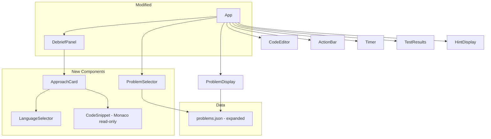
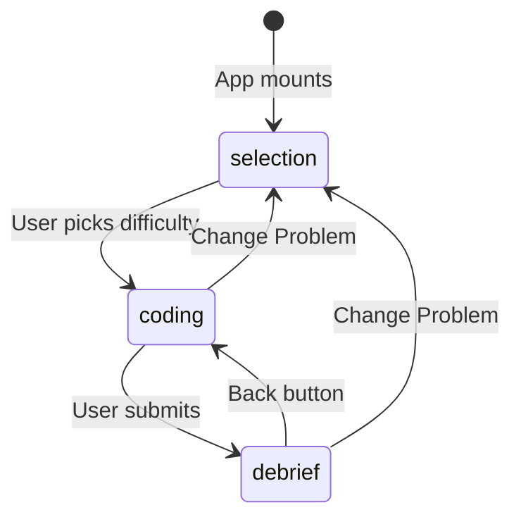

# Design Document

## Overview

This feature enhances AlgoMentor in three areas:

1. **Code solutions in alternative approaches** — The Debrief Panel's "Alternative Approaches" section is extended from text-only descriptions to include actual syntax-highlighted code implementations. Each approach card shows a read-only Monaco Editor instance with the code for that approach.

2. **Multi-language support** — Alternative approach code is provided in JavaScript, Python, and Java. A language selector tab bar within each approach card lets the user switch between languages. The default language is JavaScript. Users still write and execute JavaScript solutions — multi-language code is for reference only.

3. **Expanded problem set with difficulty selection** — The Problem Store grows from one problem (Two Sum) to at least five problems spanning Easy, Medium, and Hard difficulties. A new problem selection view replaces the auto-load behavior, letting users pick a difficulty level and receive a random problem at that tier.

### Key Design Decisions

1. **Reuse Monaco Editor for code display** — The app already depends on `@monaco-editor/react`. Rendering alternative approach code in a read-only Monaco instance gives syntax highlighting, line numbers, and consistent styling for free, with no new dependencies.

2. **Language selector as tab buttons** — A simple row of buttons (JavaScript / Python / Java) inside each approach card. Tabs are the most intuitive pattern for switching between equivalent content. Only languages with code solutions present are shown.

3. **Monaco language mapping** — Monaco's built-in language IDs are `"javascript"`, `"python"`, and `"java"`, which conveniently match the key names we use in `codeSolutions`. No mapping layer needed.

4. **Problem selection as a new view state** — The App component's `view` state gains a `"selection"` value. On mount, the app starts in the selection view instead of auto-loading the first problem. This is a minimal change to the existing state machine.

5. **Random selection within difficulty** — When multiple problems share a difficulty, one is chosen at random. This keeps the UI simple (three buttons) while still providing variety.

6. **`codeSolutions` as an optional field** — The `AlternativeApproach` data model adds an optional `codeSolutions` record. Existing approaches without code still render correctly (name + description + complexity only). This maintains backward compatibility.

## Architecture

The feature touches four areas of the existing architecture:



### Updated Application Flow



### New/Modified Files

```
src/
├── App.jsx                          # MODIFIED — add "selection" view, problem list state
├── components/
│   ├── DebriefPanel.jsx             # MODIFIED — render ApproachCard instead of inline approach
│   ├── ProblemSelector.jsx          # NEW — difficulty selection UI
│   └── ApproachCard.jsx             # NEW — approach card with language tabs + Monaco snippet
├── data/
│   └── problems.json                # MODIFIED — expanded to 5+ problems, codeSolutions added
└── services/
    └── debrief.js                   # UNCHANGED — getAlternativeApproaches already passes through
```

## Components and Interfaces

### ProblemSelector (New)

Displays three difficulty-level cards (Easy, Medium, Hard). When the user clicks one, a random problem at that difficulty is selected and the app transitions to the coding view.

```ts
interface ProblemSelectorProps {
  problems: Problem[];
  onSelectProblem: (problem: Problem) => void;
}
```

**Behavior:**
- Groups problems by difficulty
- On click, filters problems to the selected difficulty, picks one at random, calls `onSelectProblem`
- Shows the count of available problems per difficulty level
- Disables a difficulty button if no problems exist at that level

### ApproachCard (New)

Renders a single alternative approach with its metadata and an optional code snippet.

```ts
interface ApproachCardProps {
  approach: AlternativeApproach;
}
```

**Behavior:**
- Always shows: approach name, description, time complexity, space complexity
- If `approach.codeSolutions` exists and has at least one entry:
  - Renders a language selector (tab buttons) for available languages
  - Defaults to `"javascript"` if present, otherwise the first available language
  - Renders a read-only Monaco Editor instance showing the selected language's code
- If `codeSolutions` is missing or empty, renders only the text metadata (backward compatible)

### LanguageSelector (embedded in ApproachCard)

A row of tab-style buttons for switching languages. This is simple enough to be inline in ApproachCard rather than a separate component.

### CodeSnippet (embedded in ApproachCard)

A read-only Monaco Editor instance. Configuration:
- `readOnly: true`
- `minimap: { enabled: false }`
- `lineNumbers: 'on'`
- `scrollBeyondLastLine: false`
- `automaticLayout: true`
- `fontSize: 13`
- `domReadOnly: true` (prevents cursor focus stealing)
- `language` set to the selected language key (`"javascript"`, `"python"`, `"java"`)
- Height auto-sized based on line count (with a min/max)

### App (Modified)

**New/changed state:**
- `problems` — Full array of problems loaded from JSON (was implicit, now explicit)
- `view` — Gains `"selection"` value: `"selection" | "coding" | "debrief"`
- Initial `view` is `"selection"` instead of `"coding"`

**New callbacks:**
- `onSelectProblem(problem)` — Sets the selected problem, resets session state, transitions to coding view
- `onChangeProblem()` — Resets all session state and transitions back to selection view

**Changed behavior:**
- On mount, loads all problems into `problems` state, starts in `"selection"` view
- Timer starts when transitioning to coding view (not on mount)

### DebriefPanel (Modified)

**Changes:**
- The alternative approaches section replaces inline rendering with `ApproachCard` components
- Each `AlternativeApproach` object is passed to an `ApproachCard`
- No other sections change

## Data Models

### AlternativeApproach (Extended)

```ts
interface AlternativeApproach {
  name: string;
  description: string;
  timeComplexity: string;
  spaceComplexity: string;
  codeSolutions?: Record<string, string>;  // NEW — maps language key to code string
}
```

**`codeSolutions` keys:** `"javascript"`, `"python"`, `"java"`

Example:
```json
{
  "name": "Hash Map (Optimal)",
  "description": "Iterate through the array once...",
  "timeComplexity": "O(n)",
  "spaceComplexity": "O(n)",
  "codeSolutions": {
    "javascript": "function twoSum(nums, target) {\n  const map = new Map();\n  for (let i = 0; i < nums.length; i++) {\n    const complement = target - nums[i];\n    if (map.has(complement)) return [map.get(complement), i];\n    map.set(nums[i], i);\n  }\n}",
    "python": "def two_sum(nums, target):\n    seen = {}\n    for i, num in enumerate(nums):\n        complement = target - num\n        if complement in seen:\n            return [seen[complement], i]\n        seen[num] = i",
    "java": "public int[] twoSum(int[] nums, int target) {\n    Map<Integer, Integer> map = new HashMap<>();\n    for (int i = 0; i < nums.length; i++) {\n        int complement = target - nums[i];\n        if (map.containsKey(complement)) return new int[]{map.get(complement), i};\n        map.put(nums[i], i);\n    }\n    return new int[]{};\n}"
  }
}
```

### Problem (Unchanged structure, expanded data)

The `Problem` interface is unchanged. The `debrief.alternativeApproaches` array now contains `AlternativeApproach` objects with the optional `codeSolutions` field. All other fields remain the same.

### problems.json Expansion

The file grows from 1 problem to at least 5:

| # | Problem | Difficulty | Key Concept |
|---|---------|-----------|-------------|
| 1 | Two Sum | Easy | Hash map lookup |
| 2 | Valid Parentheses | Easy | Stack |
| 3 | Container With Most Water | Medium | Two pointers |
| 4 | Longest Substring Without Repeating Characters | Medium | Sliding window |
| 5 | Merge Intervals | Medium | Sorting + interval merge |

Each problem includes the full data structure: title, difficulty, description, examples, constraints, starter code, sample test cases, hidden test cases, hints, and debrief config with `codeSolutions` on each alternative approach.

## Correctness Properties

*A property is a characteristic or behavior that should hold true across all valid executions of a system — essentially, a formal statement about what the system should do. Properties serve as the bridge between human-readable specifications and machine-verifiable correctness guarantees.*

### Property 1: Approach metadata is always present regardless of language selection

*For any* `AlternativeApproach` object with `codeSolutions` and *for any* selected language, the rendered ApproachCard SHALL display the approach `name`, `description`, `timeComplexity`, and `spaceComplexity` in the output.

**Validates: Requirements 1.3, 2.5**

### Property 2: Language switching displays the correct code

*For any* `AlternativeApproach` with `codeSolutions` containing multiple languages and *for any* language key in that `codeSolutions` map, selecting that language SHALL cause the displayed code to equal `codeSolutions[selectedLanguage]`.

**Validates: Requirements 2.3**

### Property 3: Language selector shows exactly the available languages

*For any* `AlternativeApproach` with a `codeSolutions` object, the set of language options rendered in the language selector SHALL equal exactly the set of keys in `codeSolutions`.

**Validates: Requirements 2.4**

### Property 4: Debrief service passes through codeSolutions without modification

*For any* problem object whose `debrief.alternativeApproaches` entries contain `codeSolutions` fields, calling `generateDebrief` SHALL return `alternativeApproaches` where each entry's `codeSolutions` is identical to the corresponding input entry's `codeSolutions`.

**Validates: Requirements 3.3, 3.4**

### Property 5: All problem approaches include all supported languages

*For any* problem in the Problem Store and *for any* alternative approach in that problem's debrief, the `codeSolutions` field SHALL contain keys `"javascript"`, `"python"`, and `"java"`, each mapping to a non-empty string.

**Validates: Requirements 2.1, 3.2**

### Property 6: Every problem in the store has complete data

*For any* problem in the Problem Store, the problem SHALL have non-empty values for: `id`, `title`, `difficulty`, `description`, `examples`, `constraints`, `starterCode`, `sampleTestCases`, `hiddenTestCases`, `hints`, and `debrief` (including `alternativeApproaches` with `codeSolutions`).

**Validates: Requirements 4.5**

### Property 7: Difficulty-based selection always returns a matching problem

*For any* array of problems and *for any* difficulty level that has at least one problem, selecting a problem by that difficulty SHALL return a problem whose `difficulty` field equals the selected difficulty.

**Validates: Requirements 5.2, 5.3**

### Property 8: Returning to selection resets all session state

*For any* coding session state (non-empty code, non-empty test results, non-empty hints, non-zero elapsed time, non-null debrief data), triggering the return-to-selection action SHALL reset code to `""`, test results to `[]`, hints to `[]`, elapsed time to `0`, and debrief data to `null`.

**Validates: Requirements 5.6**

## Error Handling

### Missing codeSolutions

If an `AlternativeApproach` object has no `codeSolutions` field (or it is `undefined`/`null`/empty object), the `ApproachCard` renders only the text metadata (name, description, complexity). No language selector or code snippet is shown. This maintains backward compatibility with the existing data format.

### Invalid Language Key

If `codeSolutions` contains a key not in `{"javascript", "python", "java"}`, the language selector still displays it (using the key as the label). Monaco Editor falls back to plain text highlighting for unrecognized languages. This is a graceful degradation — no crash, just no syntax highlighting.

### Empty Code String

If a `codeSolutions` entry maps to an empty string, the Monaco Editor renders an empty read-only editor. The language tab is still shown. This is acceptable — the user sees an empty code block, which is self-explanatory.

### Problem Loading Errors

The existing error handling in App (setting `loadError`) continues to work. If `problems.json` fails to load, the selection view shows an error message instead of difficulty buttons.

### No Problems at Selected Difficulty

If the user selects a difficulty with zero problems (shouldn't happen with proper data, but defensively), the selector does nothing. The difficulty button is disabled when the count is zero.

### Monaco Editor Loading

Monaco Editor loads asynchronously. The existing `@monaco-editor/react` package handles loading states internally (shows "Loading..." by default). No additional loading state management is needed for the read-only code snippets.

## Testing Strategy

### Property-Based Testing

**Library**: [fast-check](https://github.com/dubzzz/fast-check) (already installed in the project).

**Configuration**: Each property test runs a minimum of 100 iterations.

**Tag format**: Each test includes a comment referencing its design property:
```
// Feature: enhanced-debrief-and-problems, Property N: <property text>
```

**Property tests to implement:**

1. **Approach metadata presence (Property 1)** — Generate random `AlternativeApproach` objects with `codeSolutions`, render `ApproachCard`, verify all four metadata fields appear in the output for each generated language selection.

2. **Language switching correctness (Property 2)** — Generate random `codeSolutions` maps with 1–3 languages, simulate selecting each language, verify the displayed code matches the selected language's value.

3. **Language selector completeness (Property 3)** — Generate random `codeSolutions` with varying subsets of language keys, render `ApproachCard`, verify the set of rendered language buttons matches the keys exactly.

4. **Debrief codeSolutions passthrough (Property 4)** — Generate random problem objects with `codeSolutions` on their approaches, call `generateDebrief`, verify the output `alternativeApproaches` preserve `codeSolutions` identically.

5. **Problem data language completeness (Property 5)** — Load `problems.json`, for every problem and every approach, verify `codeSolutions` has all three language keys with non-empty strings.

6. **Problem data completeness (Property 6)** — Load `problems.json`, for every problem, verify all required fields are present and non-empty.

7. **Difficulty selection correctness (Property 7)** — Generate random arrays of problems with various difficulties, call the selection function with each difficulty, verify the returned problem's difficulty matches.

8. **Session state reset (Property 8)** — Generate random session states, trigger reset, verify all fields return to initial values.

### Unit Tests (Example-Based)

- **ApproachCard with codeSolutions**: Render with a known approach, verify code snippet and language tabs appear (1.1)
- **ApproachCard without codeSolutions**: Render with an approach missing codeSolutions, verify no code editor rendered (1.4)
- **ApproachCard default language**: Render with all three languages, verify JavaScript is selected by default (2.2)
- **ProblemSelector rendering**: Render with problems, verify three difficulty buttons shown (5.1)
- **ProblemSelector click**: Click a difficulty, verify `onSelectProblem` called with a matching problem (5.4)
- **App initial view**: Render App, verify selection view is shown (4.3)
- **App coding view has back button**: Render in coding view, verify "Change Problem" control exists (5.5)
- **Problem store has 5+ problems**: Load problems.json, verify length >= 5 (4.1)
- **Problem store has all difficulties**: Load problems.json, verify Easy, Medium, Hard each present (4.2)

### Integration Tests

- **Full selection → coding flow**: Render App → select difficulty → verify coding view loads with correct problem
- **Full selection → coding → debrief → selection flow**: Complete a full cycle and verify state resets
- **Language switching in debrief**: Submit solution → view debrief → switch languages in approach card → verify code changes

### Test Organization

New test files:
```
src/__tests__/
├── properties/
│   └── debrief.property.test.js     # MODIFIED — add Property 4 (passthrough)
├── unit/
│   ├── ApproachCard.test.jsx         # NEW — Properties 1, 2, 3 + unit tests
│   ├── ProblemSelector.test.jsx      # NEW — Property 7 + unit tests
│   ├── problems.test.js              # MODIFIED — add Properties 5, 6
│   └── App.test.jsx                  # NEW — Property 8 + unit tests
└── integration/
    └── selectionFlow.test.jsx        # NEW — integration tests
```

