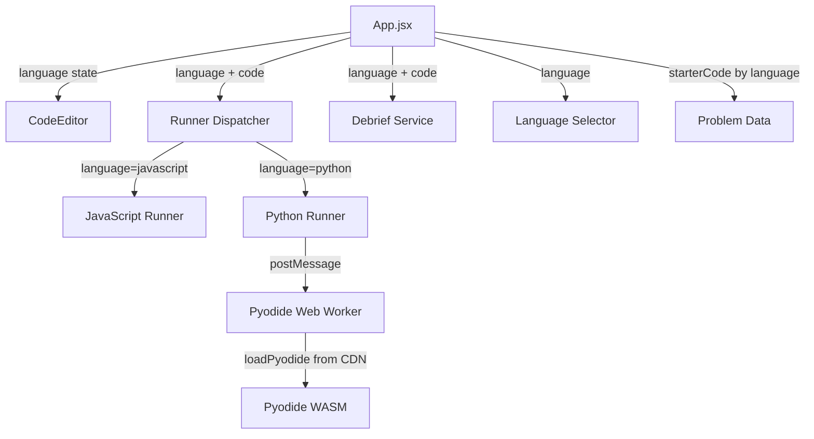

# Design Document: Python Language Support

## Overview

This design adds Python as a second coding language to AlgoMentor, making it the default. Users can switch between Python and JavaScript via a language selector in the coding view. Python code runs in-browser using [Pyodide](https://pyodide.org/) (CPython compiled to WebAssembly), loaded from the jsDelivr CDN. All five existing problems receive Python starter code with snake_case function names. The debrief service gains Python-aware heuristic analysis for complexity detection and code feedback.

### Key Design Decisions

1. **Pyodide in a Web Worker**: Python execution runs in a dedicated Web Worker to avoid blocking the main UI thread. This mirrors the existing JavaScript runner pattern (which uses `worker_threads` in Node / main-thread fallback in browser) but uses a module-type Web Worker that loads Pyodide from CDN.

2. **Eager Pyodide initialization**: Pyodide is loaded as soon as the app starts (since Python is the default language). The ~10MB WASM download happens in the background Web Worker. A loading state is tracked so the runner can return a clear error if the user tries to run code before initialization completes.

3. **Starter code stored per-language in problems.json**: Each problem gains a `starterCodePython` field alongside the existing `starterCode` (JavaScript). This avoids a breaking change to the existing data shape while cleanly separating language-specific templates.

4. **Language-aware debrief via detection**: The debrief service receives a `language` parameter and branches its regex-based heuristics accordingly — Python patterns (e.g., `for x in`, `dict()`, list comprehensions) vs. JavaScript patterns (e.g., `for (`, `new Map()`).

## Architecture



### Data Flow

1. User selects a problem → App reads `starterCode` or `starterCodePython` based on active language → editor populated
2. User switches language → App swaps starter code, updates editor language mode
3. User clicks Run/Submit → `runCode({ language, code, testCases })` dispatches to the correct runner
4. Python runner sends code + test inputs to Pyodide Web Worker → worker executes via `runPythonAsync` → returns results in the standard format
5. On Submit → debrief service receives `language` param → applies language-specific regex patterns for complexity/feedback analysis

## Components and Interfaces

### 1. Language Selector Component

**New file**: `src/components/LanguageSelector.jsx`

```jsx
// Props:
//   language    — "python" | "javascript"
//   onChange    — (language: string) => void
```

A simple toggle/dropdown in the coding view header. Renders two options. Highlights the active language. Calls `onChange` when the user picks a different language.

### 2. App.jsx State Changes

New state:
- `language` — `"python"` (default) or `"javascript"`

Modified callbacks:
- `onSelectProblem`: reads starter code based on current `language`
- `onLanguageChange`: swaps editor content to the starter code for the new language, updates `language` state
- `onRun` / `onSubmit`: passes `language` to `runCode()` and `generateDebrief()`

### 3. CodeEditor Updates

**Modified file**: `src/components/CodeEditor.jsx`

New prop:
- `language` — `"python"` | `"javascript"` (maps to Monaco's language mode)

The `defaultLanguage` prop on `<Editor>` becomes dynamic, switching between `"python"` and `"javascript"`.

### 4. Python Runner

**New file**: `src/runners/pythonRunner.js`

```js
// Public API:
export async function runPython({ code, testCases, timeoutMs = 10000 })
  // Returns: Promise<Array<{ testCaseId, passed, expected, actual, error?, timedOut? }>>

export function isPyodideReady()
  // Returns: boolean

export function getPyodideLoadError()
  // Returns: string | null
```

Internally manages a singleton Web Worker (`pythonExecutionWorker.js`). On import, kicks off Pyodide initialization in the worker. Each `runPython` call sends a message to the worker with the user code, function name (extracted via regex from `def fn_name(`), and test case inputs. A per-test-case timeout is enforced via `setTimeout` + `Promise.race`.

### 5. Pyodide Execution Worker

**New file**: `src/runners/pythonExecutionWorker.js`

Module-type Web Worker that:
1. Imports `loadPyodide` from the jsDelivr CDN
2. Calls `loadPyodide()` on startup, stores the instance
3. Listens for messages `{ code, fnName, input, id }`
4. For each message: runs user code via `pyodide.runPythonAsync(code)`, then calls the function with test inputs, converts the result to JS via `.toJs()`, and posts back `{ actual, error, id }`

### 6. Runner Dispatcher Update

**Modified file**: `src/runners/index.js`

Add import for `runPython` and a new branch:

```js
if (language === 'python') {
  return runPython({ code, testCases });
}
```

### 7. Debrief Service Update

**Modified file**: `src/services/debrief.js`

- `generateDebrief` gains an optional `language` parameter (defaults to `"javascript"` for backward compatibility)
- `analyzeTimeComplexity(code, language)` — adds Python loop patterns: `for\s+\w+\s+in`, `while\s+`, list comprehensions `\[.*\bfor\b.*\bin\b`
- `analyzeSpaceComplexity(code, language)` — adds Python data structure patterns: `dict(`, `set(`, `{}` used as dict, `[]` with `.append(`
- `generateCodeFeedback(code, language)` — adds Python-specific feedback: dictionary usage, early return, Pythonic patterns, comment detection (`#`)
- `detectNestedLoops(code, language)` — adds Python indentation-based nesting detection

### 8. Problem Data Update

**Modified file**: `src/data/problems.json`

Each problem object gains a `starterCodePython` field:

| Problem | JS function | Python function |
|---------|------------|-----------------|
| Two Sum | `twoSum(nums, target)` | `two_sum(nums, target)` |
| Valid Parentheses | `isValid(s)` | `is_valid(s)` |
| Container With Most Water | `maxArea(height)` | `max_area(height)` |
| Longest Substring | `lengthOfLongestSubstring(s)` | `length_of_longest_substring(s)` |
| Merge Intervals | `merge(intervals)` | `merge(intervals)` |

## Data Models

### Language Type

```typescript
type Language = "python" | "javascript";
```

### Problem Data (updated shape)

```typescript
interface Problem {
  id: string;
  title: string;
  difficulty: "Easy" | "Medium" | "Hard";
  description: string;
  examples: Example[];
  constraints: string[];
  starterCode: string;           // JavaScript starter code (existing)
  starterCodePython: string;     // Python starter code (new)
  sampleTestCases: TestCase[];
  hiddenTestCases: TestCase[];
  hints: HintConfig;
  debrief: DebriefConfig;
}
```

### Test Result (unchanged)

```typescript
interface TestResult {
  testCaseId: string;
  passed: boolean;
  expected: any;
  actual: any;
  error?: string;
  timedOut?: boolean;
}
```

### Pyodide Worker Message Protocol

```typescript
// Main thread → Worker
interface WorkerRequest {
  id: number;
  code: string;
  fnName: string;
  input: any[];
}

// Worker → Main thread
interface WorkerResponse {
  id: number;
  actual?: any;
  error?: string | null;
}

// Initialization status
interface InitStatus {
  type: "init";
  success: boolean;
  error?: string;
}
```

### Debrief Input (updated)

```typescript
interface DebriefInput {
  problem: Problem;
  code: string;
  results: TestResult[];
  elapsedTime: number;
  language?: Language;  // new, defaults to "javascript"
}
```


## Correctness Properties

*A property is a characteristic or behavior that should hold true across all valid executions of a system — essentially, a formal statement about what the system should do. Properties serve as the bridge between human-readable specifications and machine-verifiable correctness guarantees.*

### Property 1: Starter code selection by language

*For any* problem object that has both `starterCode` and `starterCodePython` fields, and *for any* language value in `{"python", "javascript"}`, selecting that language should return the corresponding starter code — `starterCodePython` for `"python"` and `starterCode` for `"javascript"`.

**Validates: Requirements 1.2, 1.3, 2.2**

### Property 2: Runner dispatcher routes to correct runner

*For any* language value in `{"python", "javascript"}`, calling `runCode` with that language should delegate execution to the corresponding language-specific runner (`runPython` for `"python"`, `runJavaScript` for `"javascript"`).

**Validates: Requirements 2.5, 5.1, 5.2**

### Property 3: Unsupported language throws error

*For any* string that is not `"python"` or `"javascript"`, calling `runCode` with that language should throw an error indicating the language is not supported.

**Validates: Requirements 5.3**

### Property 4: Python function name extraction

*For any* valid Python function definition of the form `def <name>(`, the Python runner's function name extraction should correctly parse the function name. The extracted name should match the original name used in the `def` statement.

**Validates: Requirements 4.2**

### Property 5: Python complexity analysis detects correct patterns

*For any* Python code string, the debrief service's time and space complexity analysis with `language="python"` should detect loop patterns (for/while/list comprehensions) and data structure patterns (dict/set/list) using Python-specific syntax, returning a valid Big-O notation string.

**Validates: Requirements 8.1, 8.2**

### Property 6: Debrief produces valid result for any language

*For any* code string (including empty strings) and *for any* supported language value, `generateDebrief` should return a valid debrief object with all required fields (`correctness`, `timeComplexity`, `spaceComplexity`, `codeFeedback`, `missedEdgeCases`, `alternativeApproaches`, `readinessScore`, `elapsedTime`) without throwing an error.

**Validates: Requirements 8.4**

## Error Handling

### Pyodide Loading Failures

- If the Pyodide CDN is unreachable or the WASM fails to load, the Python runner stores the error and `getPyodideLoadError()` returns a descriptive message.
- Any call to `runPython` while Pyodide is not ready returns test results where every test case has `error: "Python runtime is not available: <reason>"` and `passed: false`.

### Python Syntax Errors

- Pyodide's `runPythonAsync` throws a `PythonError` for syntax errors. The worker catches this and posts back `{ error: error.message }`.
- The Python runner maps this to a test result with `passed: false` and the error message.

### Python Runtime Exceptions

- If user code raises an exception (e.g., `IndexError`, `TypeError`), Pyodide wraps it in a `PythonError`. The worker catches and returns the message.
- Each test case is executed independently, so one failing test case does not prevent others from running.

### Timeout Handling

- The Python runner uses `Promise.race` with a configurable timeout (default 10 seconds, higher than JS's 5 seconds to account for Pyodide overhead).
- On timeout, the Web Worker is terminated and a new one is created for subsequent executions.
- The timed-out test case gets `{ timedOut: true, error: "Execution timed out after Xms" }`.

### Function Name Extraction Failure

- If the Python runner cannot find a `def` statement in the user's code, it returns an error for each test case: `"Could not find a named function in the provided code."` — matching the JavaScript runner's behavior.

### Worker Communication Errors

- If the Web Worker crashes or becomes unresponsive, the Python runner resolves with an error result rather than leaving promises hanging.
- A new worker is spawned for the next execution attempt.

### Debrief with Unknown Language

- If `generateDebrief` receives an unrecognized language, it falls back to JavaScript analysis patterns (backward compatible default).

## Testing Strategy

### Unit Tests

Unit tests cover specific examples, edge cases, and component behavior:

- **LanguageSelector component**: renders both options, highlights active language, calls onChange
- **CodeEditor language prop**: passes correct language to Monaco
- **Problem data validation**: all 5 problems have `starterCodePython`, Python starter code has `def` with snake_case names, JS starter code is preserved
- **Runner dispatcher**: routes "python" to runPython, "javascript" to runJavaScript, throws on unknown
- **Python function name regex**: extracts names from various `def` patterns
- **Debrief Python patterns**: specific examples of Python code with known complexity (nested for loops → O(n²), dict usage → O(n) space, etc.)
- **App language state**: defaults to "python", switches correctly, starter code swaps on language change

### Property-Based Tests

Property-based tests verify universal properties across generated inputs. The project uses **fast-check** (already installed as a dev dependency). Each property test runs a minimum of 100 iterations.

| Property | Test File | Tag |
|----------|-----------|-----|
| Property 1: Starter code selection | `src/__tests__/properties/language.property.test.js` | Feature: python-language-support, Property 1: Starter code selection by language |
| Property 2: Runner dispatcher routing | `src/__tests__/properties/runner.property.test.js` | Feature: python-language-support, Property 2: Runner dispatcher routes to correct runner |
| Property 3: Unsupported language error | `src/__tests__/properties/runner.property.test.js` | Feature: python-language-support, Property 3: Unsupported language throws error |
| Property 4: Python function name extraction | `src/__tests__/properties/language.property.test.js` | Feature: python-language-support, Property 4: Python function name extraction |
| Property 5: Python complexity analysis | `src/__tests__/properties/debrief.property.test.js` | Feature: python-language-support, Property 5: Python complexity analysis detects correct patterns |
| Property 6: Debrief valid result | `src/__tests__/properties/debrief.property.test.js` | Feature: python-language-support, Property 6: Debrief produces valid result for any language |

### Integration Tests

Integration tests verify end-to-end flows that depend on Pyodide or full component interaction:

- **Run flow with Python**: select problem → switch to Python → click Run → verify results appear
- **Submit flow with Python**: select problem → write Python solution → click Submit → verify debrief
- **Pyodide loading**: verify Pyodide initializes without blocking UI
- **Pyodide error handling**: syntax errors, runtime exceptions, timeouts

### Test Configuration

- Property tests: minimum 100 iterations per property via `fc.assert(fc.property(...), { numRuns: 100 })`
- Timeout for Python runner tests: 10 seconds (Pyodide overhead)
- Pyodide integration tests may be skipped in CI if Pyodide CDN is unavailable (marked with `describe.skipIf`)
